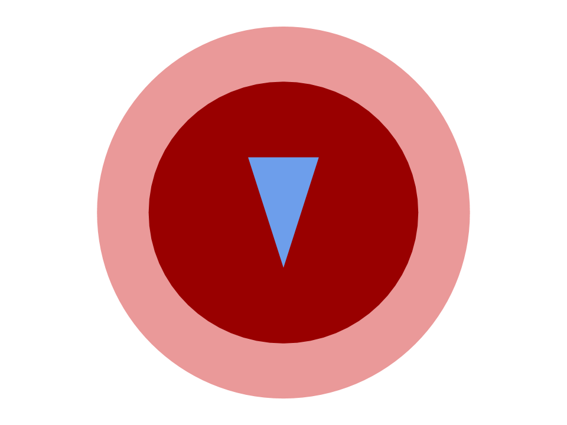

# Flocking simulation : Boids

In 1986, Craig Reynolds made a computer model of coordinated animal motion such as bird flocks and fish schools. It called the generic simulated flocking creatures **boids**. 

## Rules
The basic flocking model consists of three simple steering behaviors which describe how an individual boid maneuvers based on the positions and velocities its nearby flockmates.

| |  | |
| ------------- | ------------- | ------------- |
| **Separation**  |   | steer to avoid crowding local flockmates
| **Alignment** |   | steer towards the average heading of local flockmates
| **Cohesion** |   | steer to move toward the average position of local flockmates

## Boid vision

Dark red : Repulsion zone

Light red : attraction zone

## Simulation settings

| Parameter | Explanation |  Recommended Value|
| ------------- | ------------- | ------------- |
| fov | how far the boid can see (radius) | 80
| repulsion_fov | how far the boid sees obsacles | 40 |
| max_speed | how fast a boid can go | 6 |
| max_force | maximum force a boid can support | 0.2|
| separation_force | importance of the separation rule | 1 |
| cohesion_force | importance of the cohesion rule | 1 |
| align_force | importance of the alignment rule | 1 |
| repulsion_force | how strong a boid will try to avoid an obstacle | 5 |

## Sources
[Boids, from Craig Reynolds](http://www.red3d.com/cwr/boids/)

[Wikipedia Boid article](https://en.wikipedia.org/wiki/Boids)

[Boids Pseudocode](http://www.kfish.org/boids/pseudocode.html)

