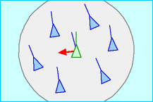

# Flocking simulation : Boids

In 1986, Craig Reynolds made a computer model of coordinated animal motion such as bird flocks and fish schools. It called the generic simulated flocking creatures **boids**. 

## Rules
The basic flocking model consists of three simple steering behaviors which describe how an individual boid maneuvers based on the positions and velocities its nearby flockmates.

**Separation**

   
steer to avoid crowding local flockmates

**Alignment**

   
steer towards the average heading of local flockmates 

**Cohesion**

   
steer to move toward the average position of local flockmates

